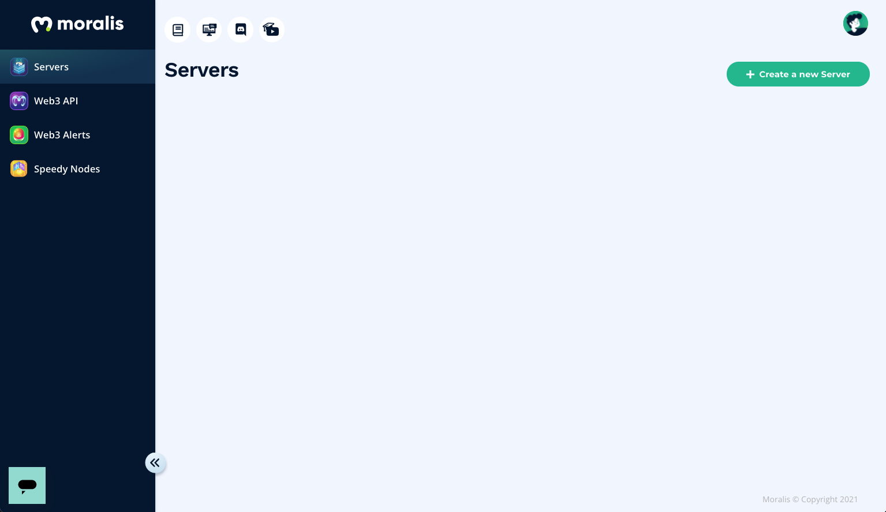
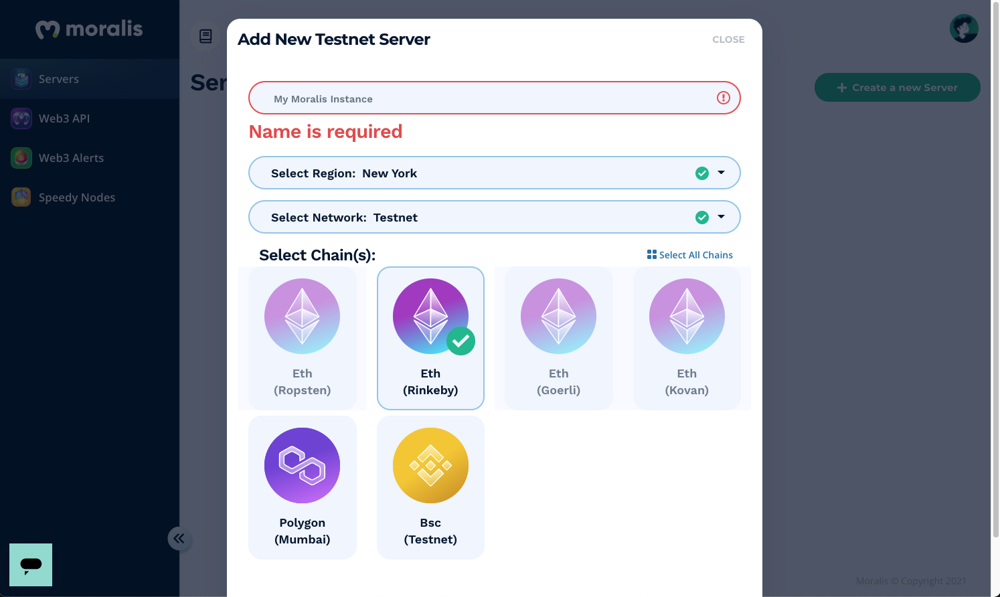
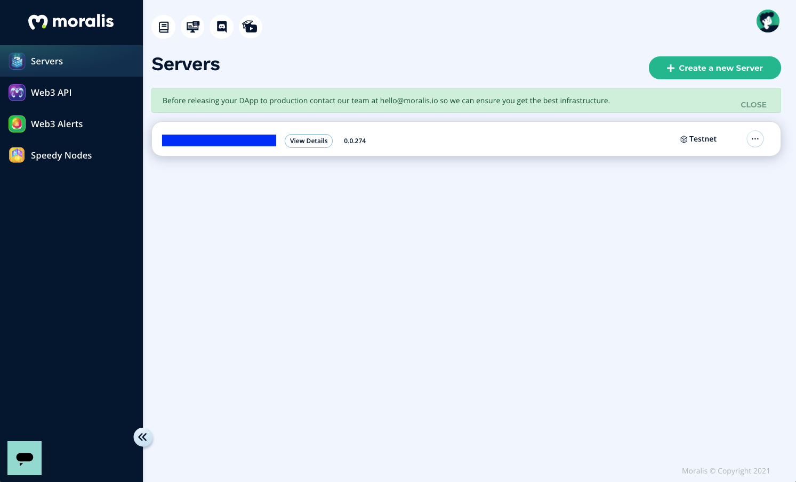
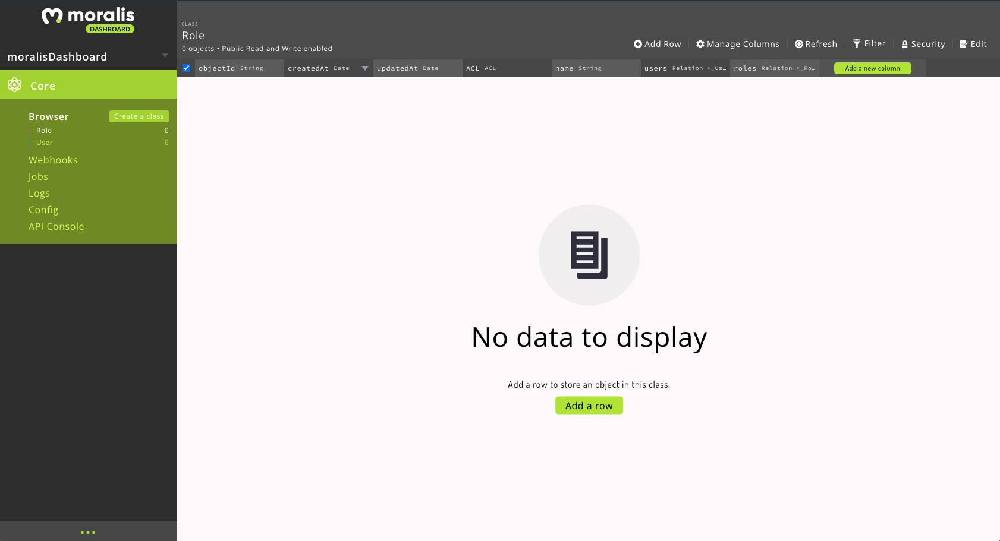

# Moralis

## What we used it for:

- Authentication using WalletConnect
- Bridge for MetaMask
- Create user profiles, for notifications, email communications, and allow users to customize their profile.

## Steps to integrate:

#1: Installed web3-provider package with npm: `npm install @walletconnect/web3-provider`

- see: [docs page on npmjs.com](https://www.npmjs.com/package/@walletconnect/web3-provider)
- see: [docs on Moralis pages](https://docs.moralis.io/moralis-server/users/crypto-login)

<br></br>
#2: Create an account and server instance on Moralis.io: https://admin.moralis.io/register



- Clicked the green button to create an instance: there are 3 options: Mainnet Server, Testnet Server, and Local Devchain Server



- we chose Testnet because it's easier to work with others in a shared Testnet than locally with a devchain (Ganache).



- it will take a couple minutes to load, but it will look like this once it's built
- click on the "more" button on the right of "Testnet" and then there will be a dropdown. Click on "Dashboard" to go to the next screen where we'll manage the database and users.


In the dashboard, you will see no data yet, because we haven't added anything yet :)

Now we want to add auth and log-in capabilities for our users in our app with these docs: https://docs.moralis.io/moralis-server/users/email-login

We'll use the `react-moralis` package for customized React functionality for Moralis: https://www.npmjs.com/package/react-moralis - we will run: `npm install react react-dom moralis react-moralis`

First, we will go to the `index.js` file and add in the Moralis components, as per the [docs](https://www.npmjs.com/package/react-moralis). We get the `appId` and `serverUrl` from the moralis dashboard when you click on details about the server instance.

```js
import React from "react";
import ReactDOM from "react-dom";
import App from "./App";
import { MoralisProvider } from "react-moralis";
// import reportWebVitals from './reportWebVitals';

ReactDOM.render(
  // <React.StrictMode>
  <MoralisProvider appId="XXXXXXX" serverUrl="XXXXXXX">
    <App />
  </MoralisProvider>,
  // </React.StrictMode>,
  document.getElementById("root")
);
```

Next, we'll call the hooks inside of the component of our SignIn page:

<br></br>
Create and use cloud functions - a secure way to process data
https://docs.moralis.io/moralis-server/cloud-code/cloud-functions#defining-cloud-functions
and also:
https://docs.moralis.io/moralis-server/cloud-code/cloud-functions

## Deployment

### Major Bug with deploying with Moralis to Netlify (build script fails because the `ethereumjs-abi` package is set of the wrong repository link - ssh instead of https)

- You get this because the way in which you used to get into `ethereumjs-abi` is deprecated and no longer works via ssh://.

```bash
10:57:52 AM: Installing NPM modules using Yarn version 1.22.10
10:57:52 AM: yarn install v1.22.10
10:57:53 AM: warning package-lock.json found. Your project contains lock files generated by tools other than Yarn. It is advised not to mix package managers in order to avoid resolution inconsistencies caused by unsynchronized lock files. To clear this warning, remove package-lock.json.
10:57:53 AM: [1/4] Resolving packages...
10:57:54 AM: [2/4] Fetching packages...
10:57:57 AM: error Command failed.
10:57:57 AM: Exit code: 128
10:57:57 AM: Command: git
10:57:57 AM: Arguments: ls-remote --tags --heads ssh://git@github.com/ethereumjs/ethereumjs-abi.git
10:57:57 AM: Directory: /opt/build/repo
10:57:57 AM: Output:
10:57:57 AM: Host key verification failed.
10:57:57 AM: fatal: Could not read from remote repository.
10:57:57 AM: Please make sure you have the correct access rights
10:57:57 AM: and the repository exists.
10:57:57 AM: info Visit https://yarnpkg.com/en/docs/cli/install for documentation about this command.
10:58:05 AM: Error during Yarn install
10:58:05 AM: Build was terminated: Build script returned non-zero exit code: 1
10:58:05 AM: Creating deploy upload records
10:58:05 AM: Failing build: Failed to build site
10:58:05 AM: Failed during stage 'building site': Build script returned non-zero exit code: 1
10:58:05 AM: Finished processing build request in 51.756767483s

```

To fix this, we have to do a couple things: remove all .lock files, node_modules folder and call yarn install again. Then manually edit in yarn.lock:

from:
"resolved": "git+ssh://git@github.com/ethereumjs/ethereumjs-abi.git#ee3994657fa7a427238e6ba92a84d0b529bbcde0"

to
"resolved": "https://registry.npmjs.org/ethereumjs-abi/-/ethereumjs-abi-0.6.8.tgz"

What we specifically change is this section in `package-lock.json`

From:

```json
    "node_modules/ethereumjs-abi": {
      "version": "0.6.8",
      "resolved": "git+ssh://git@github.com/ethereumjs/ethereumjs-abi.git#ee3994657fa7a427238e6ba92a84d0b529bbcde0",
      "license": "MIT",
      "optional": true,
      "peer": true,
      "dependencies": {
        "bn.js": "^4.11.8",
        "ethereumjs-util": "^6.0.0"
      }
    },
```

To:

```json
    "node_modules/ethereumjs-abi": {
      "version": "0.6.8",
      "resolved": "https://registry.npmjs.org/ethereumjs-abi/-/ethereumjs-abi-0.6.8.tgz",
      "license": "MIT",
      "optional": true,
      "peer": true,
      "dependencies": {
        "bn.js": "^4.11.8",
        "ethereumjs-util": "^6.0.0"
      }
    },

```

### Attempt to fix - part 2:

- ensure @walletconnect/web3-provider is installed: `npm i @walletconnect/web3-provider`
- delete /build, /node_modules, and `package-lock.json`
- go into `yarn.lock` and search for `ssh://` -- you should see something like this:

THE BAD VERSION:

```yaml
"ethereumjs-abi@git+https://github.com/ethereumjs/ethereumjs-abi.git":
  "resolved" "git+ssh://git@github.com/ethereumjs/ethereumjs-abi.git#ee3994657fa7a427238e6ba92a84d0b529bbcde0"
  "version" "0.6.8"
  dependencies:
    "bn.js" "^4.11.8"
    "ethereumjs-util" "^6.0.0"
```

- we need to change 2 things: the "resolved" prameter and the package name (source: [GitHub Issue](https://github.com/ethereumjs/ethereumjs-abi/issues/67)):
  - "ethereumjs-abi-0.6.8"
  - "resolved": "https://registry.npmjs.org/ethereumjs-abi/-/ethereumjs-abi-0.6.8.tgz"

THE GOOD VERSION:

```yaml
"ethereumjs-abi-0.6.8":
  "resolved": "https://registry.npmjs.org/ethereumjs-abi/-/ethereumjs-abi-0.6.8.tgz"
  "version" "0.6.8"
  dependencies:
    "bn.js" "^4.11.8"
    "ethereumjs-util" "^6.0.0"
```

- install the node_modules again with `yarn install`

This may change the yarn.lock file package to this, but that's ok:

```yaml
"ethereumjs-abi@git+https://github.com/ethereumjs/ethereumjs-abi.git":
  version "0.6.8"
  resolved "git+https://github.com/ethereumjs/ethereumjs-abi.git#ee3994657fa7a427238e6ba92a84d0b529bbcde0"
  dependencies:
    bn.js "^4.11.8"
    ethereumjs-util "^6.0.0"
```

Confirm that there are no instances of `ssh://` in the yarn.lock file.

- confirm that `yarn build` will build the project with no errors (this will take a while)

# Redirect logic using Moralis

You can't redirect via Moralis. But you can build redirect logic using Moralis.
Moralis.authenticate().then((user) => {
//redirect
}). catch((e) {
alert(e)
});

**My solution:** use the isAuthenticated hook and use Redirect from react-router-dom

Something like this: https://reactrouter.com/web/example/auth-workflow and this stack overflow answer: https://stackoverflow.com/questions/47476186/when-user-is-not-logged-in-redirect-to-login-reactjs

See code here:

```js
if (isAuthenticated) {

    return (
        <Redirect
        to={{
          pathname: "/",
          state: { from: location }
        }}
      />

```

## Moralis Sign Up

Need to pass in email, password, email in the onClick function of the button

Solution from forum here: https://forum.moralis.io/t/solved-cannot-sign-up-user-with-an-empty-username/2247

```js
<Button onClick={() => signup(email, password, email)}>Sign up</Button>
```
